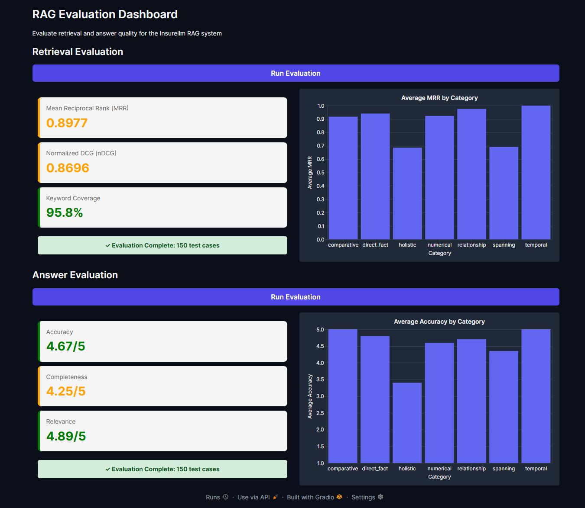

# RAG Knowledge Worker

A RAG-based AI assistant that answers questions about a company using its internal documents. Built with ChromaDB, OpenAI embeddings, LiteLLM, and a Gradio chat interface.

An LLM splits each document into overlapping chunks, each with a headline and summary. For each question, the pipeline retrieves candidates for both the original and an LLM-rewritten query, has an LLM rerank them, and passes the best chunks to the model as context.

The included knowledge base covers a fictional insurance company called Insurellm, with documents across four categories: company info, products, employees, and contracts. You can swap in your own markdown documents to adapt this to any company.

## Setup

Requires Python 3.11+ and [uv](https://docs.astral.sh/uv/).

```bash
git clone https://github.com/your-username/rag-knowledge-worker
cd rag-knowledge-worker
uv sync
cp .env.example .env
# add your OPENAI_API_KEY to .env
```

## Usage

**Step 1: Ingest documents**

This reads all markdown files from `knowledge-base/`, has an LLM split each one into chunks, embeds the chunks, and stores everything in a local ChromaDB database. It makes one LLM call per document, so it takes a few minutes. If you hit rate limits, set `WORKERS` in `ingest.py` to 1.

```bash
uv run ingest
```

**Step 2: Run the app**

```bash
uv run app
```

Opens a Gradio chat interface in your browser. Ask anything about the company. The right panel shows the retrieved context chunks that informed each answer.

## Evaluation

The `evaluation/` folder contains a set of test cases, each with a question, reference answer, and expected keywords.

Evaluation needs the vector store from Step 1 (`preprocessed_db/`, not tracked in git). If it is missing or empty, `app`, `eval`, and `evaluator` exit at startup with an error telling you to run `uv run ingest`.

To evaluate a single test case by index:

```bash
uv run eval 0
```

This runs both retrieval evaluation (MRR, nDCG, keyword coverage) and answer quality evaluation (accuracy, completeness, relevance scored by an LLM judge).

To evaluate all test cases at once, launch the evaluation dashboard:

```bash
uv run evaluator
```

Opens a Gradio dashboard with two sections, Retrieval and Answer, each with its own "Run Evaluation" button. Each section shows the averaged metrics across all test cases, color-coded green/amber/red against the thresholds in `evaluator.py`, plus a bar chart breaking down MRR (retrieval) or accuracy (answer) by question category. Answer evaluation runs the full RAG pipeline plus an LLM judge for every test case, so it takes noticeably longer than retrieval evaluation.

### Results

A full run over all 150 test cases with the default configuration:



Compared with the earlier basic pipeline (500-character chunks, no query rewriting or reranking):

| Metric | Basic | Current |
|---|---|---|
| MRR | 0.7919 | 0.8977 |
| nDCG | 0.7949 | 0.8696 |
| Keyword coverage | 93.0% | 95.8% |
| Accuracy | 4.21 / 5 | 4.67 / 5 |
| Completeness | 3.92 / 5 | 4.25 / 5 |
| Relevance | 4.63 / 5 | 4.89 / 5 |

Every metric improved. The biggest gains are on the categories that were weakest before: `spanning` MRR rose from ~0.47 to ~0.69 and `holistic` from ~0.57 to ~0.68. `temporal` and `comparative` questions now score 5 / 5 accuracy on average.

`holistic` is still the weakest category (~3.4 / 5 accuracy). These questions need information pulled from many documents at once, and ten chunks still cover only part of it.

## Project structure

```
├── app.py              # Gradio chat UI
├── evaluator.py        # Gradio evaluation dashboard over all test cases
├── answer.py           # RAG pipeline: query rewriting, retrieval, reranking, generation
├── ingest.py           # Document loading, LLM chunking, embedding, ChromaDB storage
├── config.py           # Settings shared by ingestion and retrieval
├── docs/               # README images
├── knowledge-base/
│   ├── company/        # General company documents
│   ├── contracts/      # Customer contracts
│   ├── employees/      # Employee profiles
│   └── products/       # Product descriptions
└── evaluation/
    ├── eval.py         # Retrieval and answer quality evaluation
    ├── test.py         # Test case model and loader
    └── test_cases.jsonl # Test cases: questions, reference answers, and keywords
```

## How the RAG pipeline works

1. At ingestion, an LLM splits each document into overlapping chunks. Each chunk gets a headline, a summary, and the original text, and all three are embedded together.
2. An LLM rewrites the user's question into a short, specific query, using the conversation history to resolve references like "they" or "it".
3. The 20 chunks most similar to the original question and the 20 most similar to the rewritten query are retrieved from ChromaDB and merged, with duplicates removed.
4. An LLM reranks the merged chunks by relevance to the original question, and the top 10 are kept.
5. The chunks are injected into the system prompt, and the model generates an answer.

## Configuration

Key settings are at the top of each file:

| Setting | File | Default |
|---|---|---|
| `MODEL` | `answer.py` | `openai/gpt-4.1-nano` |
| `MODEL` | `ingest.py` | `openai/gpt-4.1-nano` |
| `EMBEDDING_MODEL` | `config.py` | `text-embedding-3-large` |
| `RETRIEVAL_K` | `config.py` | 20 (candidates per query) |
| `FINAL_K` | `config.py` | 10 (chunks kept after reranking) |
| `AVERAGE_CHUNK_SIZE` | `ingest.py` | 100 (sets the chunk count the LLM is asked for) |
| `WORKERS` | `ingest.py` | 3 |

`MODEL` values are [LiteLLM model names](https://docs.litellm.ai/docs/providers), so you can switch providers (e.g. `groq/openai/gpt-oss-120b`) by changing the name and adding that provider's API key to `.env`.

If you change `EMBEDDING_MODEL` or the ingest `MODEL`, re-run `uv run ingest`.
